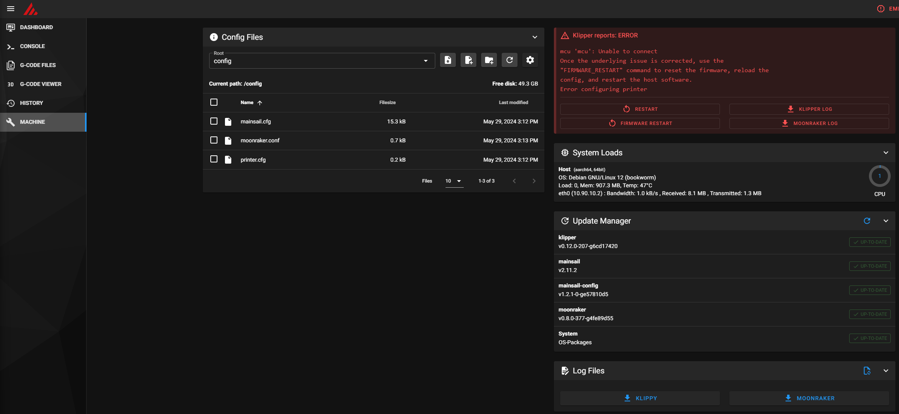
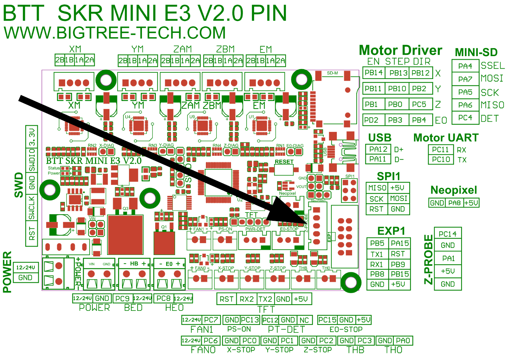

<!--
Markdown reference: https://www.markdownguide.org/basic-syntax/#ordered-lists
-->

# Install Setup of Raspberry Pi

1. Use Raspberry Pi imager to build an image
	1. OS: Raspberry Pi OS Lite
	1. Set the:
		1. Hostname
		1. Admin Credentials
		1. SSH keys
1. Insert SD Into Raspberry Pi
1. Run `sudo apt update && sudo apt upgrade`
1. Run `sudo reboot`
1. After the reboot, SSH back in
1. Run `nmtui` to configure Fixed IP
1. Configure
    1. fixed IP
    1. Gateway
    1. DNS Servers
1. Run `sudo reboot`
1. After the reboot, SSH back in
1. Run `sudo apt-get update && sudo apt-get install git -y`
1. Run `cd ~ && git clone https://github.com/dw-0/kiauh.git`
1. Run `./kiauh/kiauh.sh`
1. Install the following:
    1. Klipper
    1. Moonraker
    1. Mainsail
1. Note, you needs to be attentive so that the SSh session doesnt break as the install requires interaction
1. Run `cd /klipper`
1. Run `make menuconfig`
1. For options, reference: https://github.com/bigtreetech/BIGTREETECH-SKR-mini-E3/blob/master/firmware/V3.0/Klipper/README.md
1. Once configured, quit and save
1. Run `make`
1. Once complete, connect to the Pi using WinSCP and copy `/klipper/out/klipper.bin` to a local director on your PC
1. Rename the `klipper.bin` to `firmware.bin` and copy onto a SD/MicroSD
1. Ensure the Printer is off
1. Insert the SSD/MircoSD into the printers motherboard and power on
1. Wait 5 minutes
1. Turn off the printer and remove teh SD/MicroSD
1. Turn the Printer back on
1. Connect the PI to the printer using a USB Cable
1. SSH into the Pi and run the following: `ls /dev/serial/by-id/*`
1. you should see sommething like: 
    ```ls /dev/serial/by-id/*
    /dev/serial/by-id/usb-Klipper_stm32f103xe_33FFD5055641343404761743-if00```
1. Next navigate to the IP address of the PI (the one you setup when you gave it a fixed IT) and you should see mainsail (The Klipper web interface)
    

1. click on `printer.cfg`
1. In the editor that shows up. Clear out everything except for these bits:
    ```
    [include mainsail.cfg]

    [virtual_sdcard]
    path: /home/nerdzadmin/printer_data/gcodes
    on_error_gcode: CANCEL_PRINT```
1. Then copy the entirety of this file and paste it into the `printer.cfg` belwo the `[virtual_sdcard]` section:
    1. https://github.com/Klipper3d/klipper/blob/master/config/generic-bigtreetech-skr-mini-e3-v2.0.cfg
1. Next confirm where your CRTouch is connected to the motherboard. It should be here:
    
